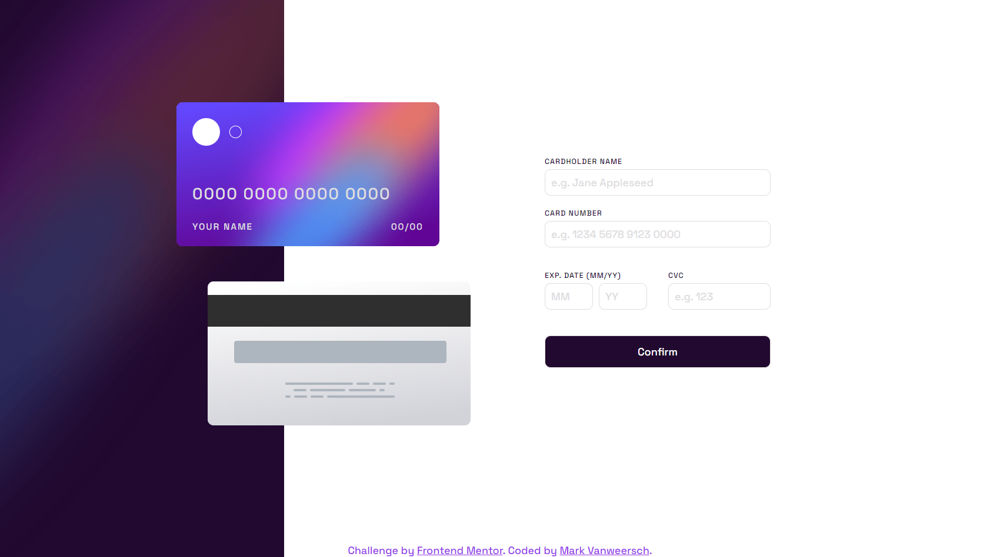
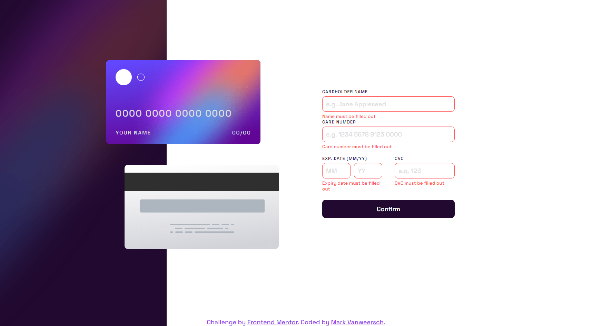
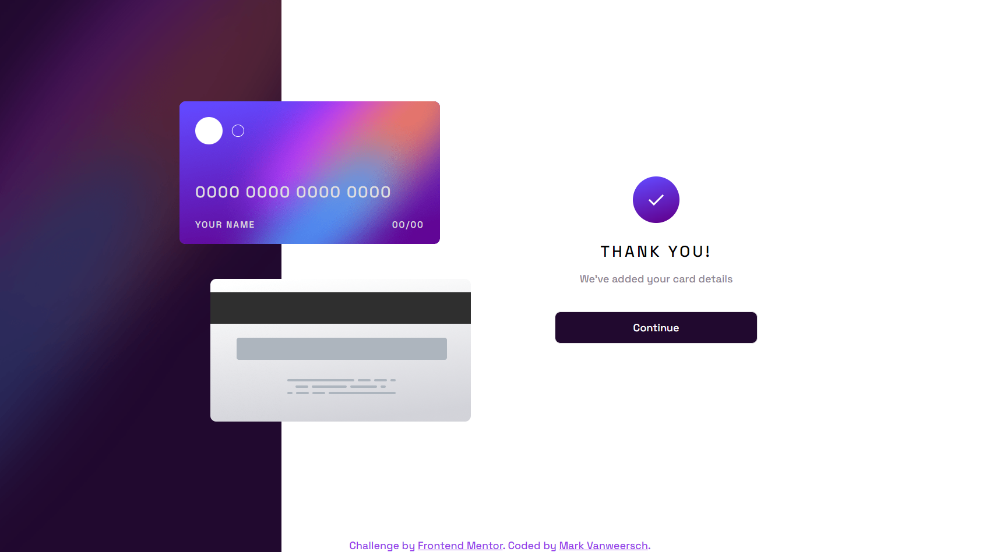
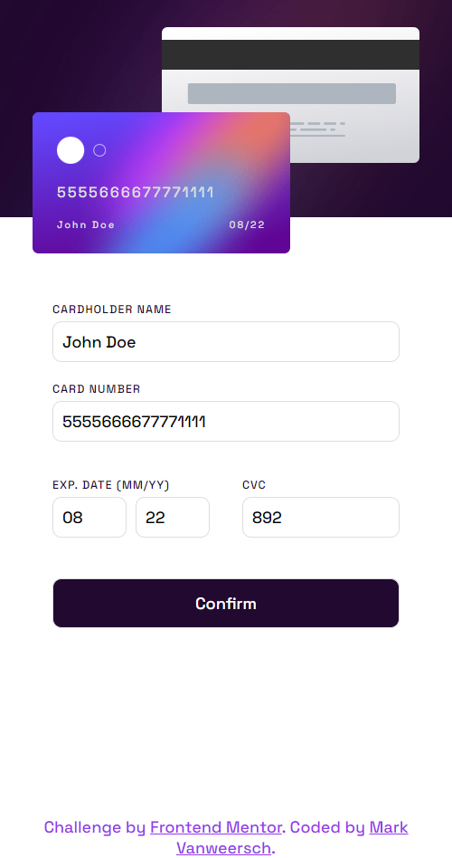
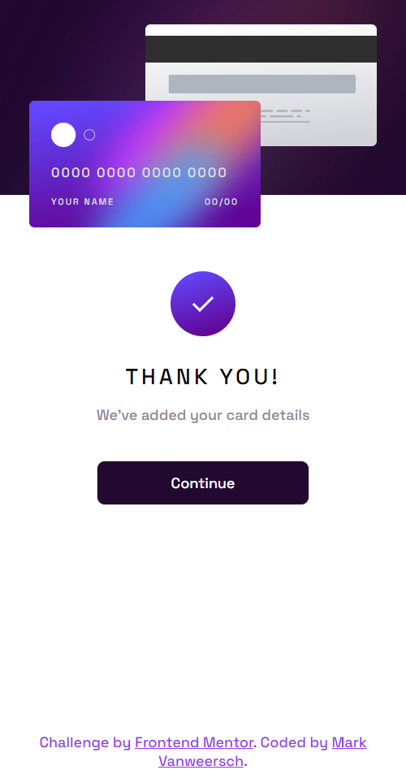

# Frontend Mentor - Interactive card details form solution

This is a solution to the [Interactive card details form challenge on Frontend Mentor](https://www.frontendmentor.io/challenges/interactive-card-details-form-XpS8cKZDWw). Frontend Mentor challenges help you improve your coding skills by building realistic projects. 

## Table of contents

- [Overview](#overview)
  - [The challenge](#the-challenge)
  - [Screenshot](#screenshot)
  - [Links](#links)
- [My process](#my-process)
  - [Built with](#built-with)
  - [What I learned](#what-i-learned)
  - [Continued development](#continued-development)
  - [Useful resources](#useful-resources)

## Overview

### The challenge

Users should be able to:

- Fill in the form and see the card details update in real-time
- Receive error messages when the form is submitted if:
  - Any input field is empty
  - The card number, expiry date, or CVC fields are in the wrong format
- View the optimal layout depending on their device's screen size
- See hover, active, and focus states for interactive elements on the page

### Screenshot

Desktop:

Desktop false input:

Desktop submitted:

Mobile:

Mobile submitted:

### Links

- Solution URL: [FrontendMentor.io](https://www.frontendmentor.io/solutions/interactive-card-details-form-with-vanilla-js-na02QVcrow)
- Live Site URL: [GitHub Pages](https://markvanweersch.github.io/interactive-card-details-form/)

## My process

### Built with

- HTML forms
- Vanilla JS
- CSS Grid and Flexbox

### What I learned

I learned more about HTML forms and how to interact with a form using JS. I found it very hard to get this challenge completed, because of submitting the form the page would refresh. My solution for this was to make a second HTML file to put in the action form.

I learned about event.preventDefault() in combination with the event "submit". Stopping the form from being submitted. Allowing validations to be performed.

### Continued development

I want to learn more about forms and using JS with it, however I feel like this is difficult to do on a local live server.

### Useful resources

- [Web Dev Simplified](https://www.youtube.com/watch?v=In0nB0ABaUk) - This helped me on how to stop a form from being submitted. As well as a more general understanding on using an HTML form and JS.